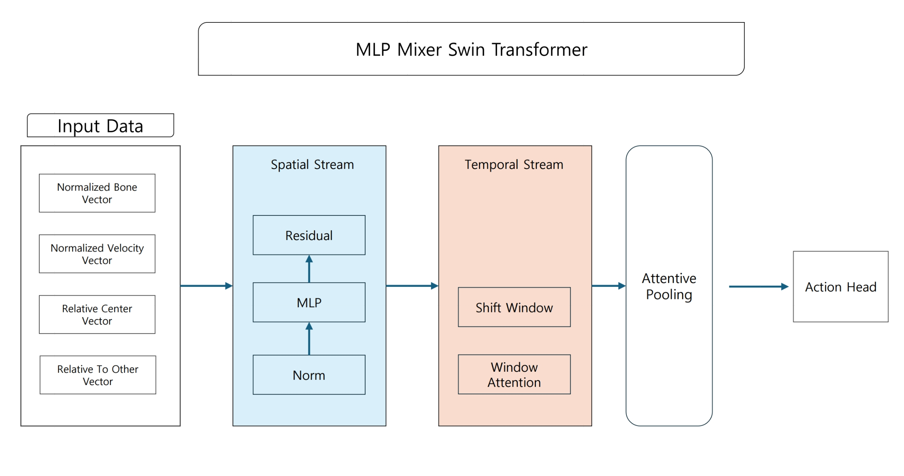
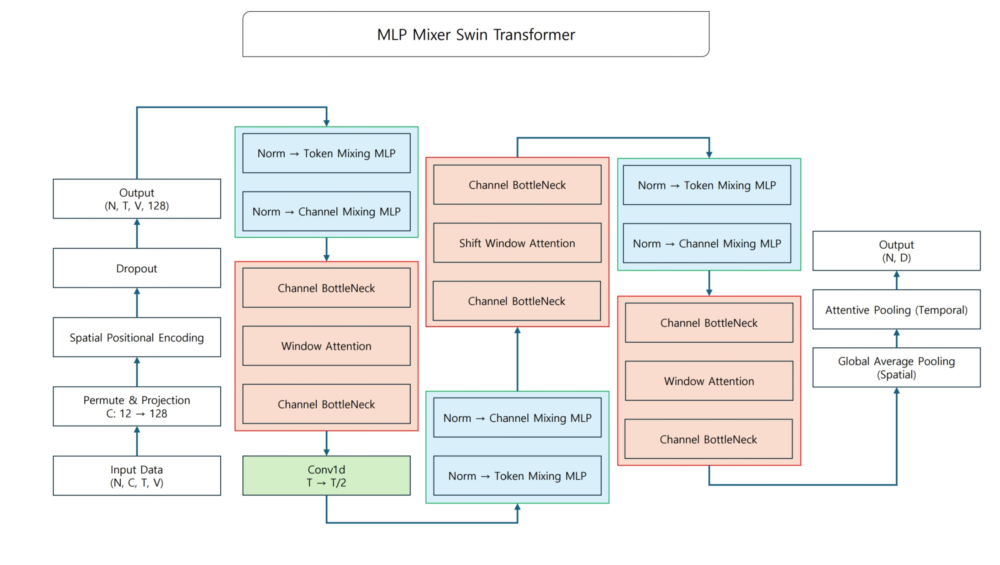
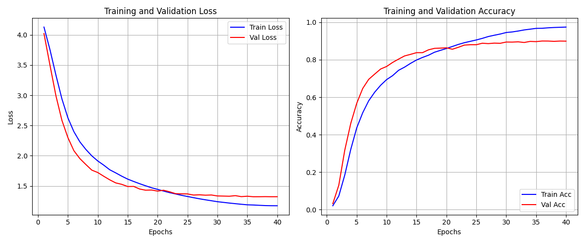
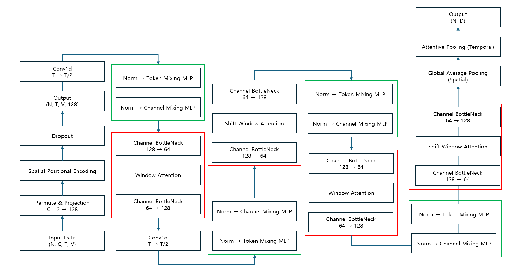

# MLP-Spatial and Factorized-Temporal Transformer 보고서

작성자: Hyeonu Seol

Undergraduate Student, Tech University of Korea, shw8128@tukorea.ac.kr

---

# 0. 요약: 행동 인식 효율성을 위한 MLP-Mixer와 Window Attention의 결합 연구

## 0-1. 연구 목적

<aside>

정확도의 타협을 최소화하면서 파라미터와 연산량을 절감할 수 있는 경량화 모델을 설계하고자 한다.

</aside>

## 0-2. 제안 방법론

<aside>

무거운 Attention 연산을 효율적인 구조로 대체하고, 행동 사전 지식을 통해 모델의 깊이를 줄인다.

1. Spatial Stream: 복잡한 Self-Attention 대신 MLP Mixer를 도입하여 관절 간의 정보 교환의 연산 효율성을 높인다.
2. Temporal Stream: Shift Window Attention을 적용하여 연산 비용을 줄이고 프레임 간의 연계성을 유지한다. 그리고 Conv1d를 통해 시간 축을 압축한다.
3. Input Feature: 12차원 벡터(Bone, Velocity, Relative Center, Relative to Other)를 사용하여 모델이 얕은 구조에서도 행동 패턴을 쉽게 학습하도록 유도한다.
</aside>

## 0-3. 핵심 결과

<aside>

NTU RGB+D 데이터셋에서 높은 효율성을 달성했다.

</aside>

| 모델 이름 | 정확도 (Xview) $\mathbb{E}_1$ | 정확도 (Xsub) $\mathbb{E}_1$ | 파라미터 수 | 연산량 |
| --- | --- | --- | --- | --- |
| Ours (3 Blocks) | 90.01% | 83.09 | 0.46M | 1.96G |
| Skateformer | 97% | 92.6% | 2.03M | 3.62G |
| HD-GCN | 95.7% | 90.6% | 1.66M | 3.44G |
| FR-Head(GCN) | 95.3% | 90.3% | 1.45M | 3.60G |

| 모델 이름 | 파라미터 당 성능 효율성 | FLOPs당 성능 효율성 | Latency (ms) | 평균 정확도 |
| --- | --- | --- | --- | --- |
| Ours(3 Blocks) | 189.02 | 44.36 | 5.55ms | 86.95% |
| SkateFormer | 46.7 | 26.19 | 11.46ms | 94.8% |
| HD-GCN | 56.14 | 27.09 | 72.81ms | 93.2% |
| FR-HEAD (GCN) | 63.93 | 25.75 | 18.49ms | 92.7% |

## 0-4. 실험 분석 및 한계

<aside>

큰 변위를 가지는 행동에서 높은 정확도를 달성했지만, 미세한 손동작이나 정적인 행동에서 정확도가 저하되었다. Bone과 Velocity 정보만으로 미세한 행동을 파악하기에 부족했던 것 같다.

하지만 정확도 손실에도 불구하고 파라미터 수와 연산량 대비 효율적인 정확도를 확보했다.

</aside>

## 0-5. 첫 번째 연구와 비교 분석

<aside>

[[첫 번째 연구 링크](https://www.notion.so/SlowFast-Spatial-Temporal-Transformer-2ec2a0bdb54f80a691c9faa407b533e0?pvs=21)] 첫 번째 연구와 비교했을 때 정확도가 Xview는 1.18%p, Xsub는 2.35%p 하락했지만 파라미터 수가 1.89M에서 0.46M으로 4배 이상 차이나고, 연산량은 3.28G에서 1.96G로 1.6배 차이난다.

이 두 연구 모두 최고 성능이 91% 근처인 것으로 볼 때, Input 데이터 구조가 모델의 최대 성능을 제한하는 원인일 수 있다. 정규화로 인한 정보 손실과 절반에 가까운 입력 채널이 다른 사람과의 상호작용에 할당된 것이 문제라고 고려된다.

추후 이 연구에서 입력 데이터를 더 물리학적으로 행동에 최적화된 정보로 가공하는 방향으로 연구할 계획이다.

</aside>

---

# 1. Abstract

<aside>

이 연구에서는 스켈레톤 기반 행동 인식에서 모델의 연산 효율성을 극대화하기 위해 MLP-Spatial and Factorized Temporal Transformer 구조를 제안한다. 기존의 Spatial-Temporal Transformer 구조는 높은 정확도를 보이지만 파라미터 수와 연산량이 높아 다중 객체 실시간 처리에 제약이 있다.

이를 개선하기 위해 Spatial 처리에 있어서 복잡한 연산을 가지는 Attention 보다는 단순한 행렬곱을 사용하는 MLP-Mixer를 도입했다. Temporal 처리에는 Shift Window Attention을 적용하여 연산 비용을 절감하면서도 프레임 사이의 연계성을 유지했다. 그리고 Conv1d를 이용한 시간 축 다운샘플링을 통해 연산량을 줄이고 중요한 정보를 압축하며, Attentive Pooling을 통해 정보 손실을 최소화하면서 중요한 프레임을 선별하고자 했다.

입력 데이터로는 척추 길이로 정규화된 Bone Vector, Velocity Vector, Relative Center Vector, Relative To Other Vector를 사용하여 행동 패턴을 학습했다. NTU RGB+D 60 데이터셋에서 X-View를 이용한 실험 결과, 90.8%의 정확도를 달성했다. 특히 SOTA 모델인 SkateFormer 대비 파라미터 수는 0.56M으로 1.47M 만큼 더 작았고, FLOPs는 2.38G로 1.24G만큼 더 작았다. 

</aside>

---

# 2. 아이디어

<aside>

Three Spatial Temporal Block 구조

</aside>

## 2-1. Input Data without Coords

### 2-1-a. Input 데이터를 미리 변형해야 하는 이유

<aside>

척추 길이를 이용한 정규화를 했다. 카메라와 피사체의 거리나 사람의 키에 상관 없이 동일한 동작은 동일한 크기의 벡터를 갖도록 만든다.

Transformer는 모든 토큰을 동등하게 취급하기 때문에 입력데이터들 사이의 관계를 학습하는 데 더 많은 층이 필요하다. 따라서 물리학적 사전지식을 포함하는 12차원의 입력 데이터를 만들어 모델에 주면 얕은 구조로도 고차원적인 행동 분류에 집중할 수 있게 된다.

아래에서 설명할 Bone Vector와 Velocity Vector는 데이터가 존재하는 공간의 위상을 명확하게 한다. 절대 좌표가 아닌 신체 중심을 기준으로 하는 상대 좌표에 대한 Bone Vector는 위치 불변성을 강화하며, Velocity Vector는 움직임 정보를 제공한다. 이를 통해 데이터의 형태들이 클래스별로 구분되기 쉬운 형태로 정렬되어 입력되고, 따라서 비선형 변환을 많이 수행하지 않아도 결정 경계를 쉽게 그릴 수 있다.

</aside>

### 2-1-b. 4가지 Input data 변형

<aside>

따라서 x, y, z 좌표 데이터를 12개의 채널을 가진 특징으로 변환한다.

Normalized Bone Vector는 부모 관절에서 자식 관절로 향하는 방향과 길이를 의미한다. 이 특징은 3차원이다. 예를 들어, 어깨에서 팔꿈치로 뻗은 팔의 각도와 방향을 나타낸다.

Normalized Velocity Vector는 현재 프레임과 이전 프레임의 좌표 차이를 계산한다. 이 특징은 3차원이다. 정지한 동작은 0이고 빠르게 움직이는 관절은 큰 값이다. 자세는 비슷하지만 속도가 다른 행동을 구분하게 한다.

Relative Center Vector는 두 사람 사이의 Global Interaction을 나타낸다. 즉, 사람1의 몸 중심과 사람2의 몸 중심 사이의 거리 벡터다. 3차원이다. 포옹이나 악수처럼 거리가 다른 행동에서 중요하다.

Relative To Other Vector는 정밀한 상호작용 디테일을 의미한다. 사람1의 모든 관절이 사람2의 몸 중심으로부터 어디에 있는지를 계산한다.

최종적으로 (Batch, Time, Joints, Dimension) 모양이 출력된다.

</aside>

## 2-2. MLP Mixer and Window Attention

<aside>

Spatial-Temporal Transformer 구조가 가진 연산 복잡도를 줄이기 위해 Spatial MLP-Mixer와 Temporal Window Attention을 도입하려고 한다.

</aside>

### 2-2-a. Spatial MLP Mixer

<aside>

Spatial Self-Attention은 관절 수의 제곱에 비례하는 연산량이 필요한데, 이를 단순한 행렬 기반 연산인 MLP-Mixer로 대체하여 연산 효율성을 극대화했다.

Token Mixing MLP는 각 관절 사이의 정보를 교환한다. 데이터 차원을 $(N \cdot T, D, J)$로 변환하고 J에 대해 Linear 연산을 수행해서 관절 정보를 섞는다. Channel Mixing MLP는 각 관절이 가진 추상적인 특징을 섞어서 고차원적인 정보를 만든다. D차원에 대해 Linear 연산을 수행한다.

</aside>

### Token Mixing

<aside>

$Z = X + \text{MLP}_{joint}(\text{RMSNorm}(X)^T)^T$

위 수식은 Token Mixing의 과정을 나타낸 것이다. 이러한 Token MLP Mixer의 세부 구조는 RMSNorm → Transpose → Linear → GELU → Dropout → Linear → Transpose Back → Residual 이다.

Token Mixing에서 입력 데이터 X는 (Batch, Time, Joints, Dimension) 형태를 가진다. 우선 Norm(X)를 통해 RMSNorm을 수행한다. Linear는 마지막 차원에 대해 행렬곱을 수행한다. 따라서 전치 (T)를 통해 (Batch*Time, Dimension, Joints)로 변환시킨다. 이 때 batch*time을 함으로써 텐서 구조를 단순화시킨다.

$MLP_{joint}()$를 통해 MLP 연산을 수행한다.

구체적으로는 $X_{mix} = \text{GELU}(W_1 \cdot X + b_1)W_2 + b_2$ 이다.

이제 다음 층을 위해 다시 구조를 (Batch, Time, Joints, Dimension)으로 복구시킨다.

그리고 원본 데이터를 보존하면서 변화량만 학습하기 위해 입력 X를 더한다.  

</aside>

### Channel Mixing

<aside>

$Y = Z + \text{MLP}_{channel}(\text{RMSNorm}(Z))$

위 수식은 Channel Mixing의 과정을 나타낸 것이다. Channel MLP Mixer의 세부 구조는 RMSNorm → Linear → GELU → Dropout → Linear → Residual 이다.

Token Mixing을 통과한 Z는 입력 (Batch, Time, Joints, Dimension)의 마지막 차원인 Dimension에 대해 정규화를 수행한다. 이 때 Batch*Time을 수행하지 않는 이유는 Dimension과 Joint를 permute할 필요가 없기 때문에 연산 속도를 높이기 위해 Batch*Time을 수행하지 않는다.

그리고 $MLP_{channel}()$을 통해 MLP 연산을 수행한다.

구체적으로는 $Z_{mix}=\text{GELU}(W_3Z+b_3)W_4+b_4$ 이다. 

</aside>

### 2-2-b. Temporal Window Attention

<aside>

Attention 연산은 비용이 많이 들기 때문에 BottleNeck을 사용해서 채널 수를 절반으로 줄이고, 연산이 끝난 뒤 다시 채널 수를 2배로 만들어 복구한다. 

연산량을 줄이는 시간축 모델링을 위해, 전체 시간을 한 번에 보지 않고 작은 윈도우로 쪼개는 Window Attention은 그 안에서의 움직임만 집중적으로 본다. 

이 때 채널을 2개로 나눠서 한 부분은 윈도우 크기를 10, 다른 부분은 윈도우 크기를 20으로 설정하여 병렬로 처리한다. 이를 통해 다양한 속도의 움직임 패턴을 동시에 학습한다.

고정된 윈도우로 인해 단절되는 정보의 흐름을 막기 위해 사용하는 Shift Window Attention은 윈도우를 시간 축으로 shift 시켜서 이전 단계에서 경계선 때문에 나눠져 있던 정보들을 연결해준다. 이 때 Cyclic Shift를 사용하는데 이 것으로 인해 발생하는 순서 섞임 문제는 마스킹을 통해 해결한다.

</aside>

<aside>

입력 데이터를 Query, Key, Value 공간으로 선형 변환한다. Temporal Window Transformer에 특징이 입력 되기 전에 (Batch, Time, Joints, Dimension) 형태가 (Batch * Joints, Time, Dimension)으로 변환된다. 이렇게 만드는 이유는 각 관절의 시계열을 독립적인 샘플로 만들기 위해서다. Batch와 Joints를 하나로 묶으면 25개의 관절 각각에 연산을 하지 않고 한 번의 행렬 연산으로 모든 관절의 시간적 특징을 동시에 학습할 수 있다. T는 10 또는 20이다. 각 Q, K, V에 대한 수식은  $Q = XW_Q +b_Q$ , $K=XW_K+b_K$ , $V=XW_V+b_V$ 이다.

그리고 Query와 Key의 내적을 통해 시간 프레임 간의 연관성을 계산한다. $Score = \frac{QK^T}{\sqrt{d_k}}$ 이다. $d_k$는 Channel을 헤드의 개수로 나눈 것이다.

이제 시간적 순서와 거리를 알려주는 학습 가능한 편향 B를 더한다. 그리고 윈도우가 shift 되었을 때 시간적으로 멀리 떨어져 있는 경우라면 음수의 무한대를 더해서 마스킹한다.

계산된 점수를 확률분포로 변환하고 이를 가중치로 삼아 Value와 곱한다. $\text{Attention Map} = \text{Softmax}(\text{Score})$ , $\text{output} = (\text{Attention Map})V$ 이다.

마지막으로 여러 개의 헤드에서 계산한 결과를 융합한다. $Y = (\text{output})W_O+b_O$ 이다.

</aside>

### 2-2-c. Conv Downsampling

<aside>

Conv1d를 사용해서 시간 축을 절반으로 줄인다. 이를 통해 데이터의 양이 줄어들어 연산 속도가 빨라진다. 그리고 시간 해상도가 낮아지면서 더 넓은 범위를 모델이 한 번에 볼 수 있다. 

Convolution을 사용함으로써 정보가 압축되기 때문에 다운샘플링을 해도 정보 손실이 최소화된다. 그리고 Convolution은 학습 가능한 파라미터를 가지고 있기 때문에, 데이터에 맞게 스스로 최적화된다.

</aside>

## 2-3. Pooling

<aside>

Global Average Pooling은 Spatial에 대한 풀링으로, 모든 관절(V)의 정보를 평균해서 관절 차원을 없앤다. 전체적인 신체 평균 상태만 본다.

Attentive Pooling은 Temporal에 대한 풀링으로, 어떤 프레임이 더 중요한지를 모델이 스스로 판단하게 한다. 움직임이 명확한 프레임은 높은 Attention 점수를 주고, 움직임이 거의 없는 프레임이나 의미가 없는 프레임은 낮은 Attention 점수를 주고 가중 합산 합니다. 이를 통해 노이즈에 강한 특성을 진다.

모델은 각 시점의 특징 벡터x가 어떤 행동에 더 가까운지 미리 예측한다.

$z_t = Wx_t + b$

이 결과 z를 softmax에 넣은 뒤 엔트로피를 계산하여 불확실성을 측정한다. 엔트로피가 높다는 뜻은 확률이 여러 클래스에 퍼져 있어서 해당 프레임은 모호하다는 뜻이고, 엔트로피가 낮다는 뜻은 특정 클래스에 확률이 높아서 해당 프레임은 특정 행동을 강력하게 나타낸다는 뜻이다. softmax의 값들 중 어느 하나가 1에 가까워서 $p_t$가 커지더라도 log는 $p_t$가 1에 가까워질 수록 log값이 0에 가까워진다. 따라서 이 둘을 곱한 엔트로피는 작다. 그리고 softmax의 값들 중 나머지들이 0에 가까워서 log값이 무한대로 커지더라도 $p_t$가 0에 가까우므로 엔트로피는 역시 작다. 하지만 애매한 경우, 즉 softmax의 값들이 모두 균등한 경우 엔트로피는 커진다.

$p_t = \text{Softmax}(z_t)$

$H(t) = -\sum_{c=1}^{C} p_{t,c} \log(p_{t,c}+\epsilon)$

엔트로피의 역수를 취해서 정보가 명확한 프레임에 높은 점수를 부여한다. 즉, 엔트로피가 작을 수록 Confidence는 1에 가까워진다.

$\text{Confidence} = \frac{1}{1 + H(x)}$

그리고 Confidence에 1을 더해서 신뢰도가 낮은 프레임이더라도 완전히 무시되지 않고 최소한의 정보는 반영되도록 한다.  그리고 모든 시간 t에 대한 가중치의 합이 1이 되도록 정규화해서, 시간축에 대한 상대적인 중요도를 계산한다.

$\alpha_t = \frac{\text{Confidence}+1}{\sum_{j=1}^{T} \text{Confidence}+1 + \epsilon}$

이렇게 계산된 가중치 $a_t$를 사용해서 입력 특징 벡터에 곱하고 가중합한다. 이렇게 되면 시간 차원은 1이 된다. $y = \sum_{t=1}^{T} \alpha_t x_t$

</aside>

## 2-4. RMSNorm

<aside>

RMSNorm은 평균을 빼는 연산을 생략한다. Transformer 구조에서 평균을 계산하고 빼는 연산은 성능 향상에 기여하지 못하고 연산량만 차지하기 때문이다. 

$\text{RMS}(x) = \sqrt{\frac{1}{d} \sum_{i=1}^{d} x_i^2 + \epsilon}$

이 수식은 입력 벡터를 제곱해서 평균을 낸 뒤 다시 제곱근을 한다. 이를 통해 벡터가 원점으로부터 얼마나 멀리 떨어져 있는지 측정한다.

그리고 입력 벡터를 RMS 값으로 나누어 정규화를 수행한다.

$\bar{x}_i = \frac{x_i}{\text{RMS}(x)}$

그리고 정규화된 값에 학습 가능한 파라미터를 곱해서 최종 출력을 낸다. 이를 통해 정규화로 인해 사라진 특징 사이의 중요도 차이를 다시 강조한다.

$y_i = \bar{x}_i \cdot g_i$

</aside>

# 3. 실험 결과

<aside>

실험은 NTU RGB+D 60 데이터셋에서 Xview와 Xsub를 기준으로 진행했다. NTU RGB+D 120 데이터셋을 사용하지 않은 이유는 현재 소유한 GPU에서는 120개의 클래스를 구분할 수 있는 모델을 구축하기 어렵다고 판단했기 때문이다.

40 epoch로 학습을 마무리했으며 이 중 초반의 10 epoch는 Warmup 기법을 사용해 학습률을 천천히 증가시켰다. 학습 스케줄러는 Cosine Decay를 사용했다. 이를 통해 40 Epoch까지 학습률을 천천히 낮추면서 학습을 진행했다.

하이퍼 파라미터 튜닝은 Optuna를 통해 수행했으며, Optuna를 사용해 20 Trial까지 수행했다.

Optimizer는 AdamW를 사용했고 이 때의 weight Decay는 0.015를 사용했다. Learning Rate는 0.000744이다. dropout은 0.11, 데이터 증강 확률은 64%, Lable Smoothing은 0.15이다. 배치 사이즈는 128로 설정했다.

</aside>

<aside>

Xview: 90.01%

</aside>

<aside>

아래는 클래스별로 낮은 점수를 기록한 하위 6개와 높은 점수를 기록한 상위 5개의 클래스를 표로 정리한 것이다.

모델의 12차원 특징들은 큰 변위를 가지는 행동에 대해 높은 변별력을 가지는 것을 볼 수 있다. 하지만 쓰기, 키보드 치기, 핸드폰 하기, 책 읽기, 두 손 비비기 등의 정적인 미세 행동에 대해서는 낮은 정확도를 보인다.

</aside>

| Class ID(하위6개, 상위 5개) | Name | Accuracy (Xview) |
| --- | --- | --- |
| 12 | writing | 60.76 |
| 30 | type on a keyboard | 67.72 |
| 29 | play with phone-tablet | 70.89 |
| 11 | reading | 72.78 |
| 34 | rub two hands | 74.68 |
| 17 | take off a shoe | 79.43 |
| 15, 9 | take off jacket / stand up | 98.42 |
| 27, 26 | jump up / hopping | 98.73 |
| 42, 22 | staggering / cheer up | 99.05 |
| 14 | put on jacket | 99.37 |
| 43 | falling down | 100 |

<aside>

Xsub: 83.90%

</aside>

| Class ID(하위6개, 상위 5개) | Name | Accuracy (Xsub) |
| --- | --- | --- |
| 12 | writing | 53.99 |
| 29 | play with phone/tablet | 55.8 |
| 11 | reading | 56.16 |
| 16 | put on a shoe | 58.7 |
| 41 | sneeze/cough | 60.87 |
| 2 | eat meal | 64.86 |
| 14 | put on jacket | 97.1 |
| 59 | walking towards | 97.46 |
| 55 | hugging | 97.83 |
| 42, 43 | staggering / falling down | 98.91 |
| 27 | jump up | 99.64 |

## 3-1. 성능 효율성 비교

<aside>

파라미터 당 성능 효율성 계산 공식은 $\text{성능} / \text{파라미터}$ 이다. Higer is better.

FLOPs당 성능 효율성 계산 공식은 $\text{성능}/\text{FLOPs}$ 이다. Higher is better.

아래 표의 정확도는 Xsub와 Xview의 정확도에 대한 평균값이다. Ours를 제외한 나머지 모델들은 SkateFormer 논문에서 발표한 결과값을 가져왔다.

다른 모델들에 비해 최고 정확도가 낮지만, 파라미터 당 성능 효율성과 FLOPs당 성능 효율성 측면에서는 매우 우수하다. 즉, 정확도 하락을 최대한 방어하면서 파라미터와 FLOPs를 줄였다.

다른 모델들에 비해 Xview 대비 Xsub의 정확도 하락폭이 심각했다. Xsub의 그래프를 보면 Xview에 비해 Overfitting이 심각한 모습을 보이고 있다.

</aside>

| 모델 이름 | 정확도 (Xview) $\mathbb{E}_1$ | 정확도 (Xsub) $\mathbb{E}_1$ | 파라미터 수 | 연산량 |
| --- | --- | --- | --- | --- |
| Ours (3 Blocks) | 90.01% | 83.09 | 0.46M | 1.96G |
| Skateformer | 97% | 92.6% | 2.03M | 3.62G |
| HD-GCN | 95.7% | 90.6% | 1.66M | 3.44G |
| FR-Head(GCN) | 95.3% | 90.3% | 1.45M | 3.60G |

| 모델 이름 | 파라미터 당 성능 효율성 | FLOPs당 성능 효율성 | Latency (ms) | 정확도 |
| --- | --- | --- | --- | --- |
| Ours(3 Blocks) | 189.02 | 44.36 | 5.55ms | 86.95% |
| SkateFormer | 46.7 | 26.19 | 11.46ms | 94.8% |
| HD-GCN | 56.14 | 27.09 | 72.81ms | 93.2% |
| FR-HEAD (GCN) | 63.93 | 25.75 | 18.49ms | 92.7% |

## 3-2. Detail

### Ours

<aside>

Stats measure on: NVIDIA RTX 5060 TI

Parameters: 0.46M

FLOPs: 1.96G

Latency: 5.55ms

FPS: 191 frames/sec

성능: 86.95%

</aside>

### SkateFormer

<aside>

Stats measure on: NVIDIA DGX A100

Parameters: 2.03M

FLOPs: 3.62G

Latency: 11.46ms

성능: 94.8%

</aside>

### HD-GCN

<aside>

Stats measure on: NVIDIA DGX A100

Parameters: 1.66M

FLOPs: 3.44G

Latency: 72.81ms

성능: 93.2%

</aside>

### FR-HEAD (GCN)

<aside>

Stats measure on: NVIDIA DGX A100

Parameters: 1.45M

FLOPs: 3.60G

Latency: 18.49ms

성능: 92.7%

</aside>

---

# 4. 추가 연구

## 4-1. GRL vs. No-GRL

<aside>

GRL이 성능 향상에 도움이 되는지 검증하기 위해 GRL을 제거해 본 결과 Xview 상황에서 테스트 정확도가 약 0.17%p 하락했다. 이는 유의미한 차이를 갖지 못하므로 GRL이 성능 향상에 도움이 된다는 것에 반대되는 결과이다.

</aside>

## 4-2. MLP vs. Attention

<aside>

MLP 대신 Attention을 사용한 결과, 연산량이 2.38G에서 3.39G에서 1.11G 증가했다. 그리고 정확도는 89.84%가 되었다.

이 때 사용한 하이퍼 파라미터는 MLP에 최적화된 하이퍼 파라미터이므로, 이를 그대로 사용할 경우 Attention에 대한 최적의 성능이 안 나올 수 있다. 

MLP-Mixer 논문을 확인해보면 MLP를 사용했을 때 CNN과 Attention을 사용하지 않고도 SOTA에 근접하는 성능에 도달했다고 나와 있다. 따라서 Attention에 대한 하이퍼 파라미터 튜닝을 수행할 경우 MLP를 사용한 모델보다 조금 더 나은 성능이 나온다고 예측할 수 있다.

하지만 연산량이 2.38G에서 3.39G로 증가한 것을 보면 Attention 대신 MLP를 사용해서 연산량을 줄이는 것이 나을 수 있다.

</aside>

## 4-3. 가공된 12차원 입력 대신 3차원 좌표값을 사용하기

<aside>

사전에 좌표값으로 어떠한 처리를 하지 않고 그대로 모델에 입력시켰을 때 78.86%의 정확도가 나왔다.

이는 모델이 얕을 수록 행동을 학습하기 위해 주어져야 하는 사전 정보가 더 많이 필요함을 알 수 있다.

</aside>

## 4-4. 3개의 Spatial-Temporal 구조 대신 4개로 늘리기

<aside>

구조1은 ST → Conv1d → ST → ST 구조인데, 구조2는 ST → Conv1d → ST → ST → ST로 단순히 ST를 한 개 더 깊게 쌓았다. 그 결과 동일한 하이퍼 파라미터 값에서 정확도가 0.53%p 하락했다.

이에 구조3인 Conv1d → ST → Conv1d → ST → ST → ST를 만들고 입력되는 시간 길이를 64에서 128로 늘렸다. 이 때 동일한 하이퍼 파라미터 값에서 정확도가 구조 1에 비해 약 0.79%p 상승했다. 이 구조3에 optuna를 통해 하이퍼 파라미터 튜닝을 해보았으나 정확도가 더 상승하지 못했다.

FLOPs당 정확도 효율성을 계산해본 결과, 구조1은 $\frac{91}{2.38} \approx 38.23$ 으로 나오고, 

구조3는 $\frac{91.79}{3.26} \approx 28.1564$ 으로 나온다. 따라서 층을 깊게 쌓았을 때 효율성이 떨어짐을 알 수 있다.

</aside>

<aside>

4블록 구조(3.26G) → 하이퍼 파라미터 튜닝을 해도 FLOPs의 상승 대비 성능 향상이 3블록 구조에 비해 크지 않다.

</aside>

## 4-5. 손과 발에 집중할 수 있는 입력 채널을 추가하기

<aside>

손 또는 발과 상호작용이 있는 행동에 집중하기 위해 척추 중심(Spine Base)에서 손/발까지의 거리를 나타내는 벡터 사용했다. 이 때 이 거리는 각 손과 발에만 할당한다. 그리고 손/발이 아닌 관절의 3개 채널은 0으로 채운다. 만약 이렇게 하지 않는다면, 위 벡터만으로도 12채널이 추가되어 총 24채널이 되므로 입력 채널의 수가 많이 상승하게 된다. 따라서 손/발이 아닌 관절의 3개 채널은 0으로 채운다.

Rub Two Hands와 Wipe Face, Play with phone-tablet 처럼 손이 중요하게 작용하는 행동에서 성능 향상이 있었다. 하지만 Back pain, Sneeze, Shake Head, Clapping은 성능이 하락했다. 손의 위치가 중요하지 않거나 손이 행동의 중심이 아닌 행동의 경우 정확도가 하락한 모습이다.

</aside>

| **Class ID** | **Name** | **12채널** | **15 채널** | **변화량** |
| --- | --- | --- | --- | --- |
| 11 | reading | 72.78 | 72.47 | -0.31%p |
| 12 | writing | 60.76 | 60.44 | -0.32%p |
| 30 | type on a keyboard | 67.72 | 68.99 | +1.27%p |
| 17 | take off a shoe | 79.43 | 77.22 | -2.21%p |
| 29 | play with phone-tablet | 70.89 | 74.37 | +3.46%p |
| 36 | shake head | 92.09 | 88.61 | -3.48%p |
| 10 | clapping | 90.19 | 86.39 | -3.80%p |
| 41 | sneeze/cough | 83.23 | 79.11 | -4.12%p |
| 46 | back pain | 87.34 | 82.91 | -4.41%p |
| 29 | play with phone/tablet | 70.89 | 74.37 | +3.46%p |
| 37 | wipe face | 80.38 | 85.13 | +4.75%p |
| 34 | rub two hands | 74.68 | 80.06 | +5.38%p |

## 4-6. Mixing Linear 은닉 차원 늘려보기

<aside>

Token Mixing의 은닉 차원을 4배로 늘려본 결과 성능이 0.9001에서 0.9132로 상승했다. 파라미터 수는 0.46M에서 0.61M이 되었고, FLOPs는 1.96G에서 2.89G가 됐다. Latency는 7.53ms이다. 하지만 늘어난 연산량 대비해서 정확도 상승을 분석해보면 효율이 31% 감소했다.

Channel Mixing의 은닉 차원을 2배로 늘려보고 실험해본 결과, xview의 성능이 0.9001에서 0.9080으로 상승했다. 이 때 파라미터 수는 0.56M이 되었고, FLOPs는 2.38G가 됐다. 하지만 늘어난 연산량 대비해서 정확도 상승을 분석해보면 효율이 17% 감소했다.

</aside>

# 5. 결론

<aside>

이 연구에서는 고성능의 행동 인식 모델이 가지는 높은 연산 비용 문제를 해결하기 위해 MLP-Spatial and Factorized-Temporal Transformer 구조를 제안했다. 제안된 모델은 공간 정보 처리에 효율적인 MLP-Mixer를 도입하고, 시간 정보 처리에는 Shift Window Attention과 Conv1d Downsampling을 결합하여 연산 복잡도를 획기적으로 낮췄다. 또한, 물리학적 사전 지식을 반영한 12차원 입력 데이터(Bone, Velocity, Interaction Vector)를 사용하여 얕은 모델 구조로도 효과적인 학습이 가능하도록 설계했다

실험 결과, NTU RGB+D 60 데이터셋의 X-View 프로토콜에서 90.01%, X-Sub 프로토콜에서 83.09%의 정확도를 달성했다. 특히 SOTA 모델인 SkateFormer와 비교했을 때, 파라미터 수는 0.46M으로 약 4.4배(2.03M 대비), FLOPs은 1.96G로 약 1.8배(3.62G 대비) 감소시키는 성과를 거두었다. 이는 정확도 측면에서 일부 타협이 있었으나, 파라미터 당 성능 효율성과 FLOPs 당 성능 효율성 측면에서는 기존 모델 대비 매우 우수한 결과를 보여주며 경량화 목표를 성공적으로 달성했음을 나타낸다.

실험 결과 Falling down이나 Jump up과 같이 변위가 큰 행동에 대해서는 높은 정확도를 보였으나, Writing, Reading, Typing 등 정적인 자세에서 국소 부위만 움직이는 행동에 대해서는 정확도가 60~70%대로 낮게 나타났다. 이는 입력 데이터로 사용된 Velocity Vector가 전신 척추 길이로 정규화되면서 손끝 등의 미세한 움직임 정보가 소실되었기 때문이다. 또한, 12차원 입력 중 절반이 타인과의 상호작용에 할당되어 있어, 1인 미세 행동을 표현하는 데 있어 정보의 밀도가 부족했던 것으로 분석된다

View(90.01%) 대비 X-Sub(83.09%)에서 성능 하락 폭이 크게 나타났으며, 학습 곡선상에서 X-Sub의 Overfitting 경향이 뚜렷하게 관찰되었다. 이를 완화하기 위해 Gradient Reversal Layer을 적용해 보았으나 유의미한 성능 향상을 거두지 못했다. 이는 피사체의 신체적 특성 변화에 모델이 충분히 강건하지 못함을 의미하므로, 향후 도메인 일반화 기법에 대한 추가적인 연구가 필요하다

손/발 중심의 추가 채널을 도입한 추가 실험에서 Phone-tablet, Rub Two Hands와 같은 특정 행동의 정확도는 상승했으나, Sneeze, Back pain 등 손의 위치가 부차적인 행동에서는 오히려 정확도가 하락하는 현상이 발생했다. 이는 모든 행동을 아우르는 최적의 입력 특징을 설계하는 것이 단순한 채널 추가만으로는 해결되지 않음을 보여준다.

</aside>

# 6. 참고한 논문

1] Is Space-Time Attention All You Need for Video Understanding?

2] Longformer: The Long-Document Transformer

3] Attentional Pooling for Action Recognition

4] Skeleton-based Action Recognition Via Spatial and Temporal Transformer Networks

5] MLP-Mixer An All-MLP Architecture for Vision

6] Unsupervised Domain Adaptation by Backpropagation

7] Graph-Guided MLP-Mixer

8] Swin Transformer

9] SkateFormer: Skeletal-Temporal Transformer for Human Action Recognition

10] Attention Is All You Need

11] 3D-CNNs on Distance Matrices for Human Action Recognition

12] Bayesian Graph Convolution LSTM for Skeleton Based Action Recognition

13] Centrality Graph Convolutional Networks for Skeleton-based Action Recognition

14] Revisiting Skeleton-based Action Recognition

15] Temporal Extension Module for Skeleton-Based Action Recognition

16] Three-Stream Convolutional Neural Network with Multi-task and Ensemble Learning for 3D Action Recognition

17] View Adaptive Recurrent Neural Networks for High Performance HumanAction Recognition from Skeleton Data
